Alef je prvo slovo hebrejskog jezika i predstavlja glavu bika što označava: snagu, vodju i Boga. Sva slova u hebrejskom jeziku imaju svoj piktograf (simbol koji ima određeno značenje) i numeričku verdnost odnosno gematriju, što je u slučaju slova **א alef 1**.\
\
Na slici ispod možemo videti ceo alefbet, sva slova, njihove piktografe, značenje i numeričke vrednosti. Ova tabela će nam biti vrlo važna referenca i u nastavku.

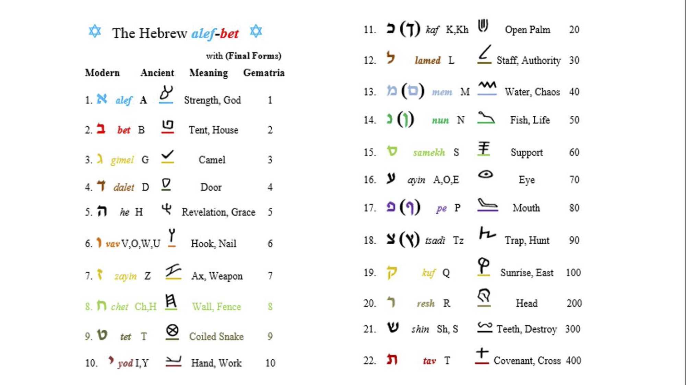

Pogledajmo sada neke reči koje počinju sa slovom **א Alef**:

`av = אב = Otac`

`elohim = אלהים = Bog`

`adonai = אדני = Gospod`

`ehja ešer ehja = אהיה אשר אהיה = Ja Sam koji Jesam`

Otac se u hebrejskom jeziku kaže **av** ali ono takođe ima svoje starinsko značenje. **א** predstavlja snagu, a slovo **ב** kuću kao što možemo videti iz table iznad, dakle ***"snaga kuće"*** jeste **av otac**.

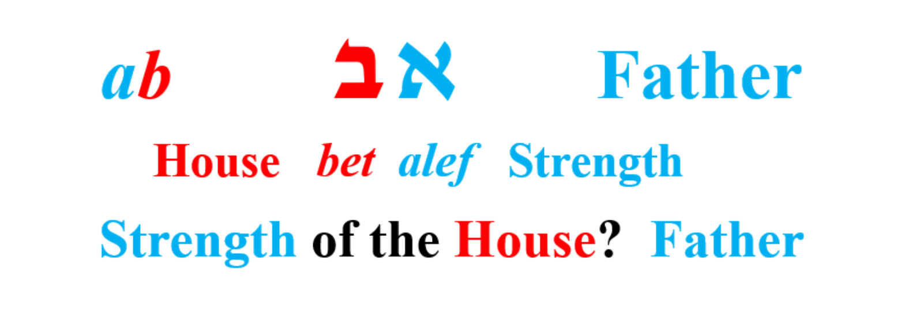

Najvažnija imena i titule koje Bog koristi u Bibliji počinju sa slovom alef. Poslednji primer jeste izjava iz **2. Mojsije 3:14**, gde se Mojsije obraća Bogu i pita ga kako se zove, a on mu odgovara sa čuvenom izjavom **"Ja Sam koji Jesam"** *,* i zatim Bog nastavlja i kaže:

>  Idi i reci sinovima Izraelovim Onaj koji Jeste (יהוה) me je poslavo vama.

 Odatle dobijamo čuveni tetragramaton **יהוה**, koga najčešce izgovaraju kao Jahve ili Jehova, u nastavku ja ću referisati ovo ime kao **JHVH**  što predstavlja svako pojedinačno slovo iz ovog imena jud, he, vav i he ili **Gospod** kako je u našem prevodu.

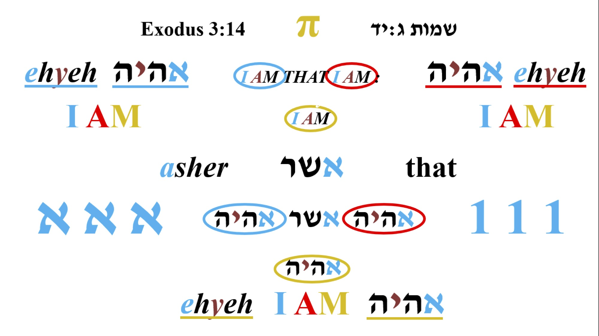

Na slici iznad možemo primetiti, da u jednoj rečenici Bog spominje svoje ima **3** puta, što je vrlo zanimljivo jer On ne radi ništa slučajno kao što će mo i videti u nastvku. 

Takođe ako sakupimo inekse slova (NE numeričku verdnost ili gematriju nego poziciju slova u alefbetu), u izjavi *"Ja Sam koji Jesam" ,* dobijamo sledece...

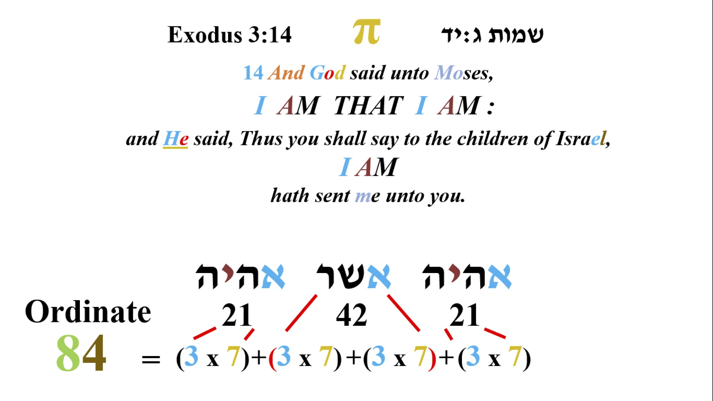

Vrlo je zanimljivo ponavljanje ovih brojeva 3 i 7 kroz celu Bibliju, a ovo je samo jedan od mnogo primera. Znamo da broj 7 predstavlja puninu ili savrešenstvo, Bog je stvorio svet za 6 dana i sedmi dan posvetio. Zato je čovekov broj ili broj zveri 6 jer predstavlja nesavršenstvo. Ovo je neka vrsta Božjeg pečata tako da znamo šta je nadahnuto Njegovim duhom a šta nije, jer danas imamo mnoge apokrife i knjige koje mnogi pokušavaju da uključe u sastav Biblije.

Ovo kažem ne samo zbog ovog primera nego bezboj drugih za koje se nadam da ću imati prilike da pišem u narednom periodu, gde možemo videti da događaji, imena koja je su u suprotnosti sa Bogom ili Božjim zakonom imaju numeričku vrednost koja je na neki način vezana za broj 6, a ono što je od Boga za najčešće 3 ili 7,. Što se tiče broja 3 ostavljam vama da razmišljate, ovde ću pokazati još jedan zanimljiv primer:

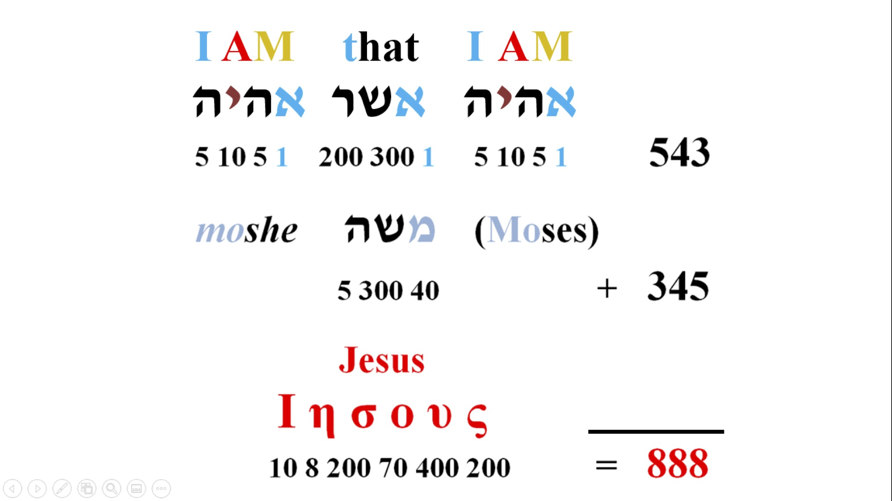

Ako uzmemo gematriju ili numeričku vrednost ove izjave, dobijamo broj **543** što je vrlo slično numeričkoj vrednosti Mojsijevog imena (Moše) **345**, kada sakupimo ova dva broja dobijamo **888** što je Isusova numerička vrednost u grčkom alfabetu, danas imamo većinski sačuvane spise Novog zaveta na grčkom prevodu.

`Bog + Prorok = Isus`

Sada bih spomenuo nešto zanimljivo sa početka Tore (prvih pet knjiga Mojsijevih koja se zovu ***"učenje"***), pogledajmo sledeću sliku:

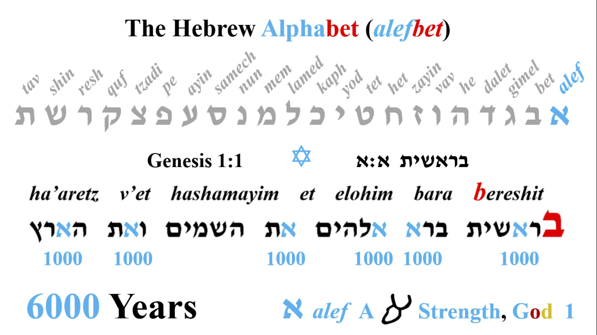

> Berešit bara Elohim et hašamaim va'et ha'arec (U početku stvori bog nebesa i zemlju.)

 Samo ova rečenica je toliko kompleksna i sadrži bezbroj dimenzija o kojima bih mogao da pričam dan i noć, ali da se mi vratimo na alef. Vidmo da se alef u prvoj rečenici pojavljuje 6 puta, a rekli smo da slovo **א** ima gematrisku vrednost **1** ali moze da bude i 1000 jer pismo kaže:

> Jedan dan pred Gospodom je kao hiljadu godina i hiljadu godina kao jedan dan. (2. Petar 3:8)

Hiljadu se na hebrejskom kaže elef što je prektično isto kao alef. Znači alef moze da znači 1 ili 1000. Dakle ovde imamo period od 6000 godina koliko ce trajati zemlja, a zatim 1000 godina ili takozvani *mesijanski period.*

Zapazite i poziciju slova **א** u rečenici, vidmo da se alef u prve dve reči nalazi na trećem i na trećem mestu, pa onda na drugom i na drugom i na kraju na prvom i na prvom mestu. Onvde imamo **3** para slova alef, a kao što vidimo pozicija slova je takođe veoma bitna. 

Zapovest kaze da se ništa ne dodaje ili oduzima iz zakona, pa čak i jedno slovo, a na sledećem primeru će mo to ponovo potvrditi...

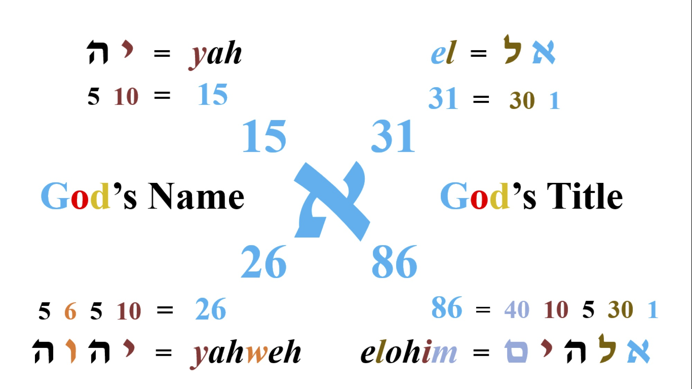

Sakupimo sada numeričke vrednosti Božjeg imena **JHVH** (Gospod) i titule **Elohim** (Bog), i takođe skraćene verzije **יה** (**Ja**) i **אל** (**El**). Skraćeni oblici se najčešće koriste u imenima, daću vam par primera:

Elijahu (Ilija) = **אליה**ו = JHVH (Gospod) je moj Bog

Daniel (Danijel) = דני**אל** = Bog je moj sudija

Irmejahu (Jeremija) = ירמ**יה**ו = JHVH (Gospod) će uzdići

Sakupljanjem numeričkih vrednosti ovih imena dobijamo sledeće: **15, 26, 31, 86**. Ako sada brojimo slova sa početka Tore (Biblije), videćemo nešto vrlo interesantno, da su 15., 26., 31. i 86. slovo **א Alef**. Bog nam i ovde potvrđuje da je on Alef.

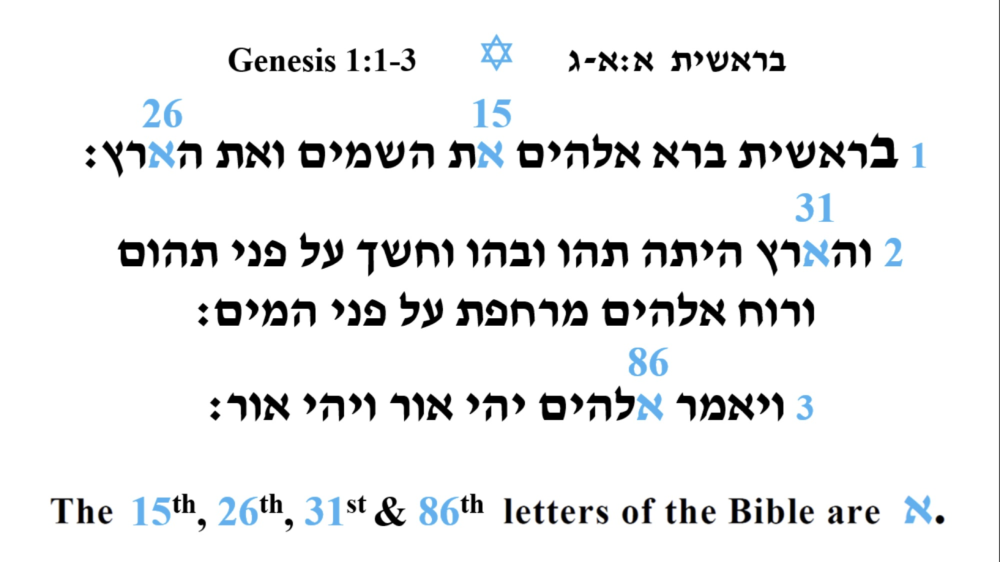

Ako i dalje sumljate, sakupimo sada sve indekse ili poziciju slova alef u prvoj rečenici. Dobijamo broj **86**, a već nam je poznato da je to numerička verdnost reči **Elohim** (Bog).

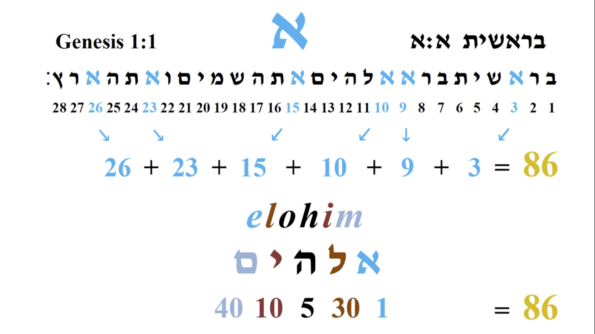

Možda bi ste se zabitali, pa da ako je alef toliko važno slovo zašto Bog započinje Bibliju sa drugim slovom alefbeta slovom **ב bet**. Kao što sam već spomenuo Bog ne radi ništa slučajno pa čak i u ovako naizgled bezazlenom primeru.

Dakle da bi postalo sve što je jeste, mora da postoji uzrok, neko ko će sve to stvoriti. Mi znamo da je to Tvorac ili kao što smo već utvrdili **א Alef.** 

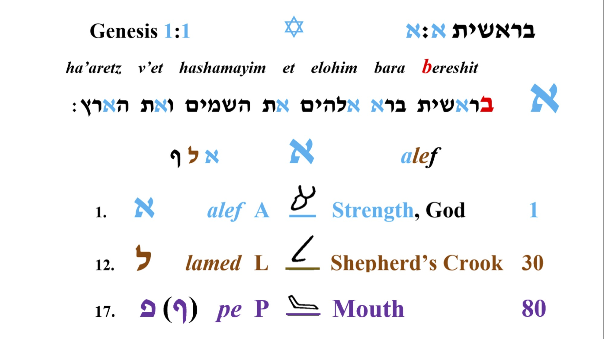

I ovde imamo vro lepu sliku koja ilustruje Alef koji je bio u početku, sve je postalo preko njega i bez njega ništa nije postalo. Namerno sam ovako rekao jer deluje poznato **Jovan 1:2-3**. Jovan nam između ostalog kaže da je reč u početku bila u Boga i Bog je bio reč, a samo slovo alef možemo zapisati kao reč **אלף alef**.

> U Početku je bila reč, i reč je bila kod Boga, i Bog je bila reč. Ona je u početku bila kod Boga. Sve je postalo preko nje i bez nje ništa nije postalo.

Kao što već zamo da **א alef** ima piktograf glave bika što označava snagu, **ל lamed** će predstavljati pastirki štap, što znači da je **אל El** ***"snažni pastir"***, a slovo **פ pej/fej** predstavlja usta. Tako da sam reči **אלף alef** će znači: ***"Iz usta snažnog pastira"*.**

Nemojte da vas zbuni ovaj drugi oblik slova **ף** fej koji se zove fej sofit. U hebrejskom jeziku pored 22 slova postoje i 5 sofit formi, jedno od tih slova je i **פ fej** (sofit forma: **ף**). Suština je u tome da kada se to slovo nadje na kraju reči jednostavno se drugačije piše tj. ima drugačiji oblik na kraju reči, ali se isto izgovara. Sama reč sofit znači na kraju ili krajnje.

Ako bi namerno napisali pogrešno **אלפ,** ovakakv oblik slova fej predstavlja zatvorena usta, a ako malo bolje pogledamo u samom slovu **פ fej,** mogli bi smo stvaiti slovo **ב bet.** Dakle sada imamo **s*nažnog pastira koji u svojim ustima ima slovo ב***.

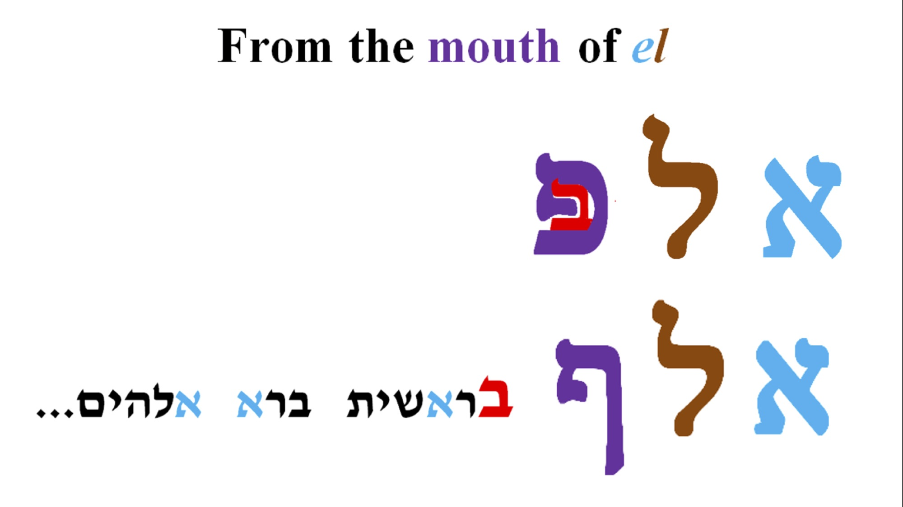

Takođe sam pomenuo da je oblik slova takođe vrlo bitan. Ako ste nekad pisali slovo alef primetili ste da vam je potrebno **3** poteza. Zašto Bog ne bi za svoje slovo uzeo nešto jednostavnije što bi se moglo napisati iz jednog poteza da ukazuje na to da je on 1, ne on nam ovde opet potvrđuje da je njegova priroda kompleksna i ima veze sa brojem 3. Opet kažem, ako postoji tvorac ništa ne može biti slučajno.

Ustvari sva tri poteza koja sačinjavaju slovo **א alef,** su ustvari druga dva "prostija" slova u hebrejskom jeziku, a to su: **י jud** i **ו vav**. Znači da bi napisali slovo **א alef**, potrebno je napisati vav koji je nagnut na levu stranu, i zatim dopišemo jud odozgo i odozdo.

Podsetimo se opet sa početne tabele šta predstavljaju jud i vav? **י jud** će predstavljati ruku što iznačava rad, a **ו vav** ekser ili nešto što spaja.

Kada sve saberete imamo jednu vrlo zanimljivo sliku: ruka odozgo (Božja), ruka odozdo (čovečja grešna) i jedan ekser koji ih spaja (Mesija/Hristos)!!

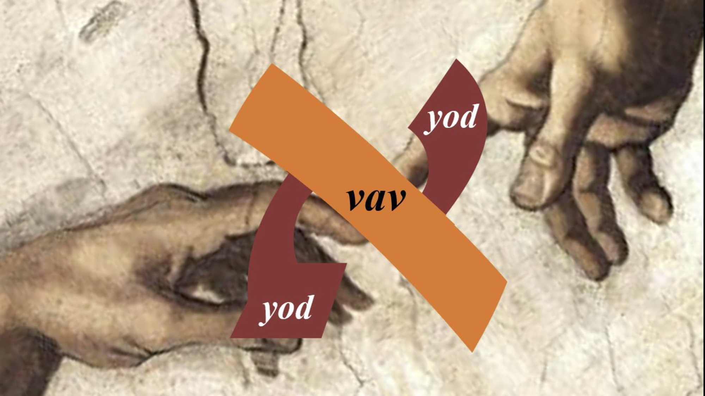

Primetili smo da **ו vav** ne stoji uspravno kao što bi trebalo, to je zato što ono predstavlja Mesiju koji stoji uspravno (čovek koji nije grešan stoji uspravno), koji će morati da se ponizi da bi spojio čoveka sa Bogom, takođe samo slovo vav predstavlja ekser.

> Osim toga, kad je po obličju postao čovek, ponizio se i postao poslušan sve do smrti, i to smrti na krstu. (Filibljanima, 2:8)

O da, umalo da zaboravim, ako sakupimo numeričke vrednost ovih slova dobijamo sledeće:

`Jud י 10 + Jud י 10 + Vav ו 6 = JHVH 26 יהוה`

Isto je i sa pisanom formom:

`Kaf 20 כ + Vav ו 6 = JHVH 26 יהוה`

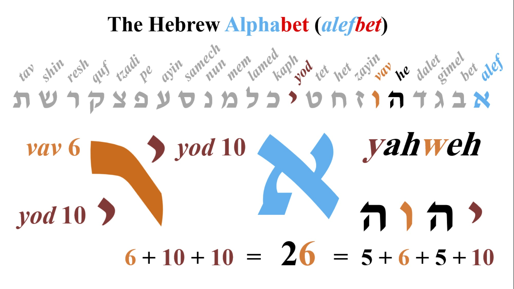

# Bonus

Jedna zanimljiva pesma iz spisa **"שיר השירים (pesma nad pesmama)"**,[ שיר](https://www.youtube.com/watch?v=qYpYzf3xlAc&list=PLeXpWRgWgS3xTVON2ZMDI5dNjcmY_m86n&index=22&ab_channel=12TribesMusic).

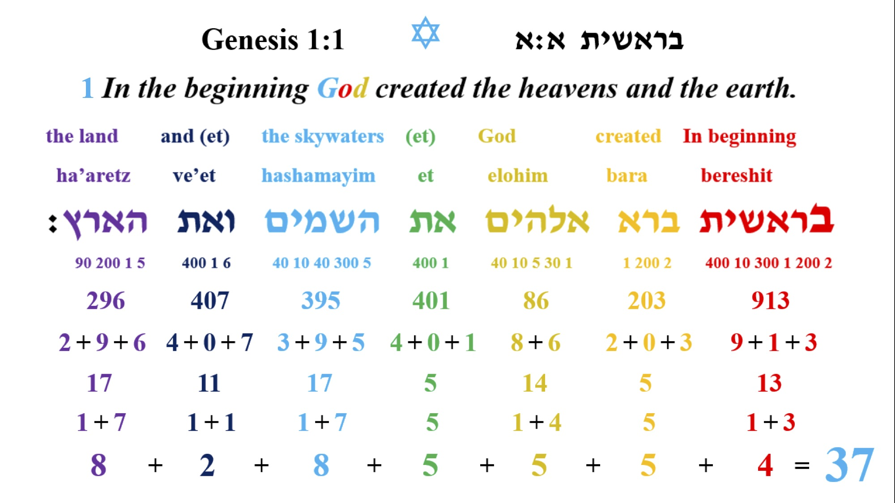