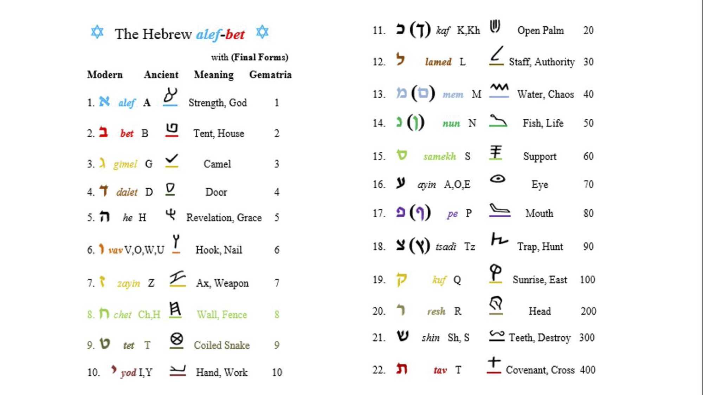
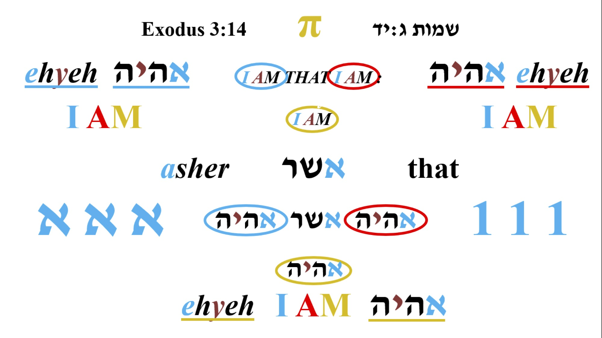
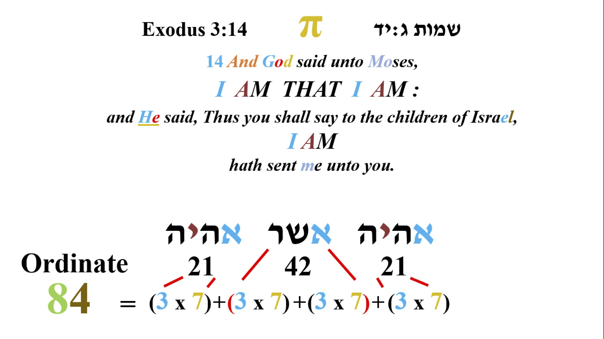
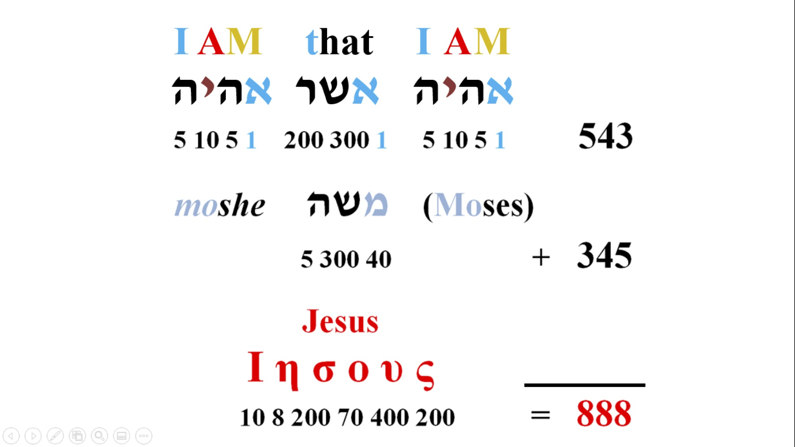
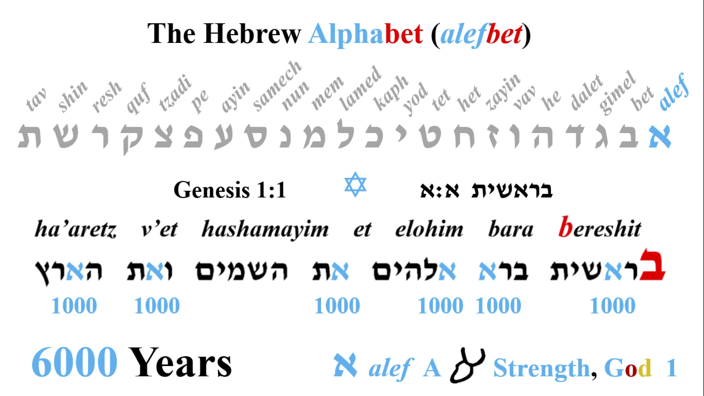

Alef je prvo slovo hebrejskog jezika i predstavlja: snagu, vodju i Boga. Sva slova u hebrejskom jeziku imaju svoj piktograf i određenu numeričku verdnost koja ide uz njih, pa tako imamo da alef predstavlja glavu bika i ima numeričku verdnost 1.

Sad pogledajmo neke reči koje počinju sa ovim slovom:

`elohim = אלהים = Bog `

`adonai = אדני = Gospod`

`ehja ešer ehja = אהיה אשר אהיה = Ja Sam koji Jesam`

Možemo videti da najažnija imena i titule koje Bog koristi u Bibliji počinju sa slovom alef. Poslednja izjava je iz 2. Mojsijeve, 3:14, kada se Mojsije obraća Bogu i pita ga kako se zove, a on mu odgovara sa čuvenom izjavom *"Ja Sam koji Jesam",* i zatim Bog nastavlja i kaze: *"Idi i reci sinovima Izraelovim Onaj koji Jeste (יהוה) me je poslavo vama.״*. Odatle dobijamo čuveni tetragramaton **יהוה**, koga najčešce izgovarmo kao Jahve ili Jehova.

Na slici iznad možemo primetiti da u jednoj rečenici Bog spominje svoje ima 3 puta što je meni vrlo zanimljivo jer tvorac ne radi ništa slučajno, zatim na sledećoj slici ako sakupimo index slova (NE numeričku verdnost ili gematriju nego poziciju slova u alefbetu), u izjavi *"Ja Sam koji Jesam" , dobijamo sledece...*

Vrlo je zanimljivo ponavljanje ovih brojeva kroz celu Bibliju 3 i 7, a ovo je samo jedan od mnogo primera. Znamo da broj 7 predstavlja puninu ili savrešenstvo, Bog je stvorio svet za 6 dana i sedmi dan posvetio. Zato je čovekov broj ili broj zveri 6 jer predstavlja nesavršenstvo. Ovo je neka vrsta Božjeg pečata tako da znamo šta je nadahnuto Njegovim duhom a šta nije, jer danas imamo mnoge apokrife i knjige koje mnogi pokušavaju da uključe u sastav Biblije. Ovo kažem ne samo zbog ovog primera nego bezboj drugih za koje se nadam da ću imati prilike da pišem u narednom periodu, gde možemo videti da događaji, imena koja je su u suprotnosti sa Bogom ili Božjim zakonom imaju numeričku vrednost koja je na neki način vezana za broj 6, a ono što je od Boga za najčešće 3 ili 7. Što se tiče broja 3 ostavljam vama da razmišljate, ovde ću pokazati još jedan zanimljiv primer:

Ako uzmemo numeričku vrednost Ove izjave, dobijamo broj **543** što je vrlo slično numeričkoj vrednosti Mojsijevog imena (Moše) **345**, kada sakupimo ova dva broja dobijamo **888** što je Isusova numerička vrednost u grčkom alfabetu, jer danas imamo većinski sačuvane spise Novog zaveta na grčkom. Znači u prevodu:

`Bog + Prorok = Isus`

Sada bih spomenuo nešto nazimljivo sa početka tore (prvih pet knjiga mojsijevih koja se zovu ״učenje״). Pogledajmo sledeću sliku:

*"Berešit bara Elohim et hašamaim va'et ha'arec (U početku stvori bog nebesa i zemlju.)"*. Samo ova rečenica je toliko kompleksna i sadrži bezbroj dimenzija o kojima bih mogao da pričam dan i noć, ali da se mi vratimo na naše slovo alef.\
\
Vidmo da se alef u prvoj rečenici pojavljuje 6 puta, broj 6 smo već spomenuli u predhodnim pasusima. 6 slova alef mogu da predstavljaju i 6000 jer znamo: 

*`"Jedan dan pred Gospodom je kao hiljadu godina i hiljadu godina kao jedan dan. (2. Petar 3:8)"`*

Hiljadu se na hebrejskom kaže elef što je prektično isto kao alef. Znači alef moze da znači 1 ili 1000. I ovde imamo period od 6000 godina koliko ce trajati zemlja i sledećih hiljadu godina je takozvani mesijanski period kad se zemlja odmara posle dolaska Hrista i svršetka ovog sveta kakvog znamo.

Zatim zapazite i poziciju slova u rečenici, vidmo da se alef u prve dve reči nalazi na trećem i na trećem mestu, pa onda na drugom i na drugom i na kraju na prvom i na prvom mestu. Opet imamo hintove za broj 3, ostavam vama da razmišljate o tome.