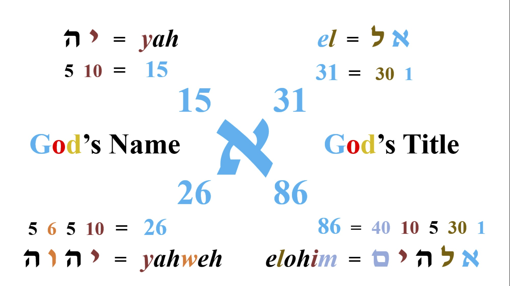
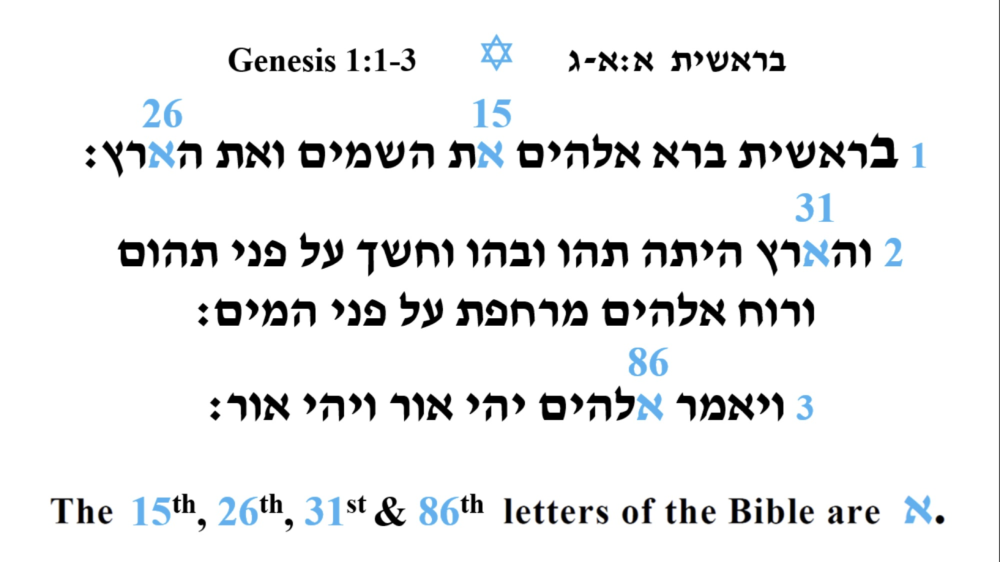
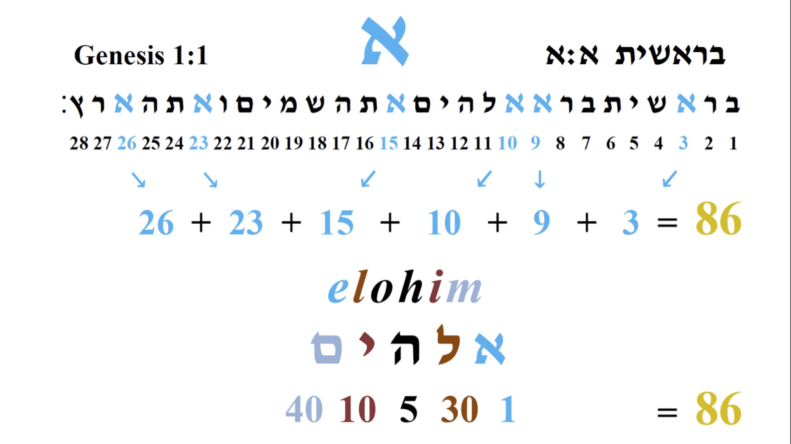
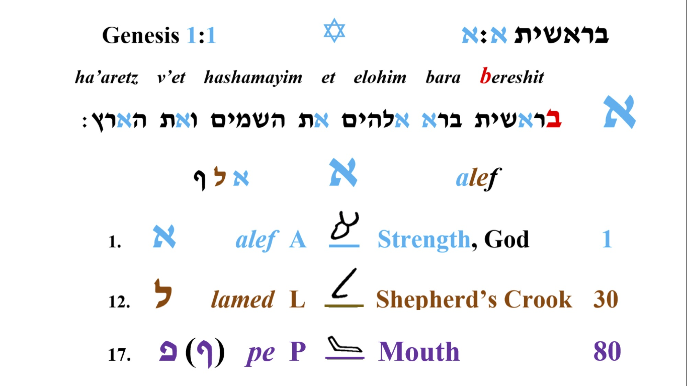
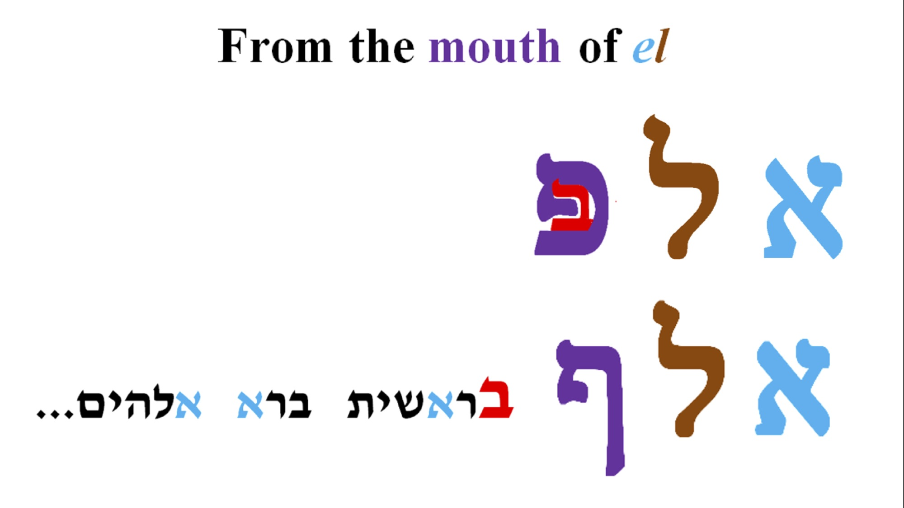
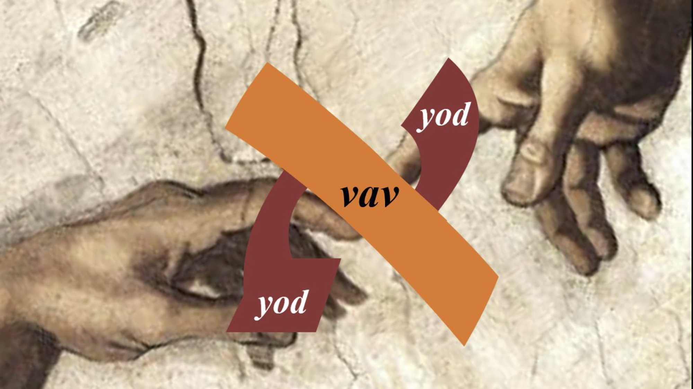

Alef je prvo slovo hebrejskog jezika i predstavlja: snagu, vodju i Boga. Sva slova u hebrejskom jeziku imaju svoj piktograf i određenu numeričku verdnost koja ide uz njih, pa tako imamo da alef predstavlja glavu bika i ima numeričku verdnost 1.

Sad pogledajmo neke reči koje počinju sa ovim slovom:

`elohim = אלהים = Bog`

`adonai = אדני = Gospod`

`ehja ešer ehja = אהיה אשר אהיה = Ja Sam koji Jesam`

Možemo videti da najažnija imena i titule koje Bog koristi u Bibliji počinju sa slovom alef. Poslednja izjava je iz 2. Mojsijeve, 3:14, kada se Mojsije obraća Bogu i pita ga kako se zove, a on mu odgovara sa čuvenom izjavom *"Ja Sam koji Jesam",* i zatim Bog nastavlja i kaze: *"Idi i reci sinovima Izraelovim Onaj koji Jeste (יהוה) me je poslavo vama.״*. Odatle dobijamo čuveni tetragramaton **יהוה**, koga najčešce izgovarmo kao Jahve ili Jehova.

Na slici iznad možemo primetiti da u jednoj rečenici Bog spominje svoje ima 3 puta što je meni vrlo zanimljivo jer tvorac ne radi ništa slučajno, zatim na sledećoj slici ako sakupimo index slova (NE numeričku verdnost ili gematriju nego poziciju slova u alefbetu), u izjavi *"Ja Sam koji Jesam" , dobijamo sledece...*

Vrlo je zanimljivo ponavljanje ovih brojeva kroz celu Bibliju 3 i 7, a ovo je samo jedan od mnogo primera. Znamo da broj 7 predstavlja puninu ili savrešenstvo, Bog je stvorio svet za 6 dana i sedmi dan posvetio. Zato je čovekov broj ili broj zveri 6 jer predstavlja nesavršenstvo. Ovo je neka vrsta Božjeg pečata tako da znamo šta je nadahnuto Njegovim duhom a šta nije, jer danas imamo mnoge apokrife i knjige koje mnogi pokušavaju da uključe u sastav Biblije. Ovo kažem ne samo zbog ovog primera nego bezboj drugih za koje se nadam da ću imati prilike da pišem u narednom periodu, gde možemo videti da događaji, imena koja je su u suprotnosti sa Bogom ili Božjim zakonom imaju numeričku vrednost koja je na neki način vezana za broj 6, a ono što je od Boga za najčešće 3 ili 7. Što se tiče broja 3 ostavljam vama da razmišljate, ovde ću pokazati još jedan zanimljiv primer:

Ako uzmemo numeričku vrednost Ove izjave, dobijamo broj **543** što je vrlo slično numeričkoj vrednosti Mojsijevog imena (Moše) **345**, kada sakupimo ova dva broja dobijamo **888** što je Isusova numerička vrednost u grčkom alfabetu, jer danas imamo većinski sačuvane spise Novog zaveta na grčkom. Znači u prevodu:

`Bog + Prorok = Isus`

Sada bih spomenuo nešto nazimljivo sa početka tore (prvih pet knjiga mojsijevih koja se zovu ״učenje״). Pogledajmo sledeću sliku:

*"Berešit bara Elohim et hašamaim va'et ha'arec (U početku stvori bog nebesa i zemlju.)"*. Samo ova rečenica je toliko kompleksna i sadrži bezbroj dimenzija o kojima bih mogao da pričam dan i noć, ali da se mi vratimo na naše slovo alef.\
\
Vidmo da se alef u prvoj rečenici pojavljuje 6 puta, broj 6 smo već spomenuli u predhodnim pasusima. 6 slova alef mogu da predstavljaju i 6000 jer znamo: 

*`"Jedan dan pred Gospodom je kao hiljadu godina i hiljadu godina kao jedan dan. (2. Petar 3:8)"`*

Hiljadu se na hebrejskom kaže elef što je prektično isto kao alef. Znači alef moze da znači 1 ili 1000. I ovde imamo period od 6000 godina koliko ce trajati zemlja i sledećih hiljadu godina je takozvani mesijanski period kad se zemlja odmara posle dolaska Hrista i svršetka ovog sveta kakvog znamo.

Zatim zapazite i poziciju slova u rečenici, vidmo da se alef u prve dve reči nalazi na trećem i na trećem mestu, pa onda na drugom i na drugom i na kraju na prvom i na prvom mestu. Onvde imamo 3 para slova alef, i kao što vidimo pozicija slova je vrlo bitna, zato zapovest kaze da se ništa ne dodaje ili oduzima iz zakona, pa čak i jedno slovo, a na sledećem primeru će mo to ponovo potvrditi...

Sakupimo sada numeričke vrednosti Božjeg imena (JHVH) i titule (Elohim), i takođe skraćene verzije Jah i El. Skraćeni oblici se najčešće koriste na primer u imenima, daću par primera:

Elijahu (Ilija) = **אליה**ו = JHVH (Gospod) je moj Bog

Daniel (Danijel) = דני**אל**  = Bog je moj sudija

Irmejahu (Jeremija) = ירמ**יה**ו = JHVH (Gospod) će uzdići

Vratimo se zada na poentu, sakupljanjem gematriskih ili numeričkih vrednosti slova dobijamo sledeće: **15, 26, 31, 86**. Ako bi sada brojali slova od početka tore, videćemo nešto vrlo interesantno da 15, 26, 31 i 86 slovo jeste  **א  Alef**. Bog nam i ovde potvrđuje da je on Alef.

Ako i dalje niste uvereni iz nekog razloga, sakupite sada sve indeke broja alef u prvoj rečenici (ili poziciju slova). Dobijamo broj **86**, a već nam je poznato da je to numerička verdnost reči **Elohim** (Bog).

Rekli bi smo, pa da ako je alef toliko važno slovo zašto Bog započinje bibliju sa drugim slovom alefbeta slovom **ב bet**. Kao što sam već spomenuo Bog ne radi ništa slučajno pa čak i u ovako naizgled bezazlenom primeru.

Da bi tora i sve što je postalo moglo da postane, mora da postoji neko ko će sve to stvoriti. Mi znamo da je to Tvorac ili kao što smo već utvrdili **א Alef.** I ovde imamo vro lepu sliku koja ilustruje Alef koji postoji pre svega i iz njegovih usta je postalo sve što je postalo. Namerno sam ovako rekao jer deluje poznato **Jovan 1:1**. Jovan nam između ostalog kaže da je reč u početku bila u Boga i Bog je bio reč, a sama reč alef se može zapisati, na sledeći način **אלף alef**.

Kao što već zamo da **א alef** ima piktograf glave bika što označava snagu, vodju, Boga, ako se vratimo na na prvu sliku koja prikazuje tabelu svih slova i značenja, vidimo da **ל lamed** predstavlja pastirki štap, znači da **אל El** predstavlja snažnog pastira, a slovo **פ pej/fej** predstavlja usta. Tako da sam reči **אלף alef** znači: **"Iz usta snažnog pastira".**

Nemoj te da vas zbuni ovaj drugi oblik slova **ף** fej koji se zove fej sofit. U hebrejskom jeziku pored 22 slova postoje i 5 sofit formi, jedno od tih slova je i **פ** (sofit forma: **ף**). Suština je u tome da kada se to slovo nadje na kraju reči jednostavno se drugačije piše tj. ima malo drugačiji oblik nego inače ali se isto izgovara. Sama reč sofit znači na kraju ili krajnje.

Ako bi namerno napisali pogrešno **אלפ,** ovakakv oblik slova fej/pej bi značio zatvorena usta i ako malo bolje pogledate u samom slovu **פ** može perfektno stati slovo  **ב**, dok sofit forma **אלף** izgleda kao otvorena usta. Ako sada sve sabereme imamo sledeću sliku...

Tkaođe sam spomenuo da je oblik slova vrlo bitan, ako ste nekad pisali slovo alef primetili ste da vam trebaju **3** poteza. Zašto ne bi za svoje slovo uzeo nešto jednostavnije što bi se moglo napisati iz jednog poteza da ukazuje na to da je on 1, ne on nam ovde daje hint na njegovu prirodu koja ima veze sa brojem 3. Kažem opet ako postoji tvorac ništa ne može biti slučajno. 

Ustvari sva tri poteza koja sačinjavaju slovo **א alef** su druga prostija slova u hebrejskom jeziku, a to su: **י jud** i **ו vav**. Znači napišemo vav koji je nagnut na jednu stranu, i zatim dopišemo jud odozgo i odozdo.

Podsetimo se opet sa početne tabele šta predstavljaju jud i vav? **י jud** predstavlja ruku što iznačava rad a **ו vav** ekser ili nešto što spaja.

Kada sve saberete imamo jednu vrlo zanimljivo sliku: Ruka odozgo (božja čista), ruka odozdo (čovečja grešna) i jedan ekser koji ih spaja (Mesija)!! 

Primećujemo da ovo **ו vav** ne stoji uspravno kao što bi trebalo, to je zato što on predstavlja Mesiju koji stoji uspravno (čovek koji nije grešan stoji uspravno) koji će morati da se ponizi da bi spojio čoveka sa bogom.

O i da umalo da zaboravim, ako sakupimo numeričke vrednost ovih slova, dobijamo sledeće:

`Jud י 10 + Jud י 10 + Vav ו 6 = JHVH 26 יהוה`

Isto je i sa pisanom formom:

`Kaf 20 כ + Vav ו 6 = JHVH 26 יהוה`

