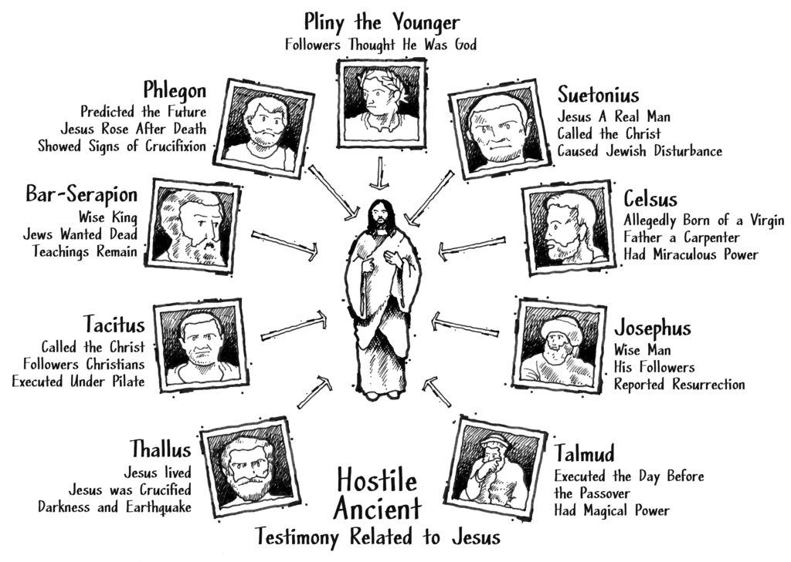

Možda će za nekoga to biti iznenađenje ali Novi zavet nije jedini istoriski izvor koji govri o Isusu Hristu. Novi zavet se sastoji od četiri nezavisna dokumenta očevidaca događaja koje zovemo Jevanđelje i brojne druge spise i poslanice apostola gde postoje odlični dokazi o životu, učenjima, smrti i vaskrsenju Isusa Hrista, ali da li postoje i drugi dokazi koji to potvrđuju? Da li postoje spisi van Novog zaveta koji potvrđuju ili podupiru bilo koje suštinske stvari o Isusu ili ranom hrišćanstvu? 

 

Ovde cemo ćitirati jedne od najpouzdanijih jevreskih i paganskih ali i u većini slučajeva i neprijateljski nastorjenih izvora prema hrišćanima 1. i 2. veka n.e.

### 1. Josif Flavije

[Yosef ben Matityahu (37 - 100)](https://sr.wikipedia.org/sr-el/%D0%88%D0%BE%D1%81%D0%B8%D1%84_%D0%A4%D0%BB%D0%B0%D0%B2%D0%B8%D1%98%D0%B5) je bio veoma značajan jevrejski istoričar prvoga veka. Rođen je 37. godine i napisao najvećim delom svoja 4 dela do kraja prvog veka. On je bio farisej, njegovo najpoznatije delo je **"Starine" (The Antiquities 94 n.e.)** i predstavljalo je istoriju jevrejskog naroda od nastanka pa do njegovog vremena. 

 

Zbog njegove naklonosti prema Rimljanima njega su mrzeli njegovi sunarodnici Jevreji, međutim on je postao veoma popularan među hričćanima zbog svojih radova u kojima se pozivao na Jakova, Isusovog brata i na samog Isusa.\
\
U Starinama se prvi put pojavljuje dokaz o Isusu van Jevanđelja. Ovde se opisuje kako je visoki sveštenik zvani Ananija iskoristio smrt rimskog guvernera Festa da bi ubio Jakova.

> Sazvao je sastanak Sinedriona i izveo pred njega čoveka zvanog Jakov, Isusovog brata, koji je zvan Hrist i određene druge ljude. Optužio ga je da je prekršio zakon i predao ih da budu kamenovani.

Nijedan naučnik nije uspešno opovrgao ovaj tekst. Da je ovo bilo kasnije dodavanje hrišćana verovatno bi pohvalnije govorilo o Jakovu, tako da ovde imate pozivanje na Isusovog brata koji je verovatno bio preobraćen posle Hristovog vaskrsenja ako uporedite sa **Jovan 7:5** gde se vidi da njegova braća nisu iskazivala vere u njega ranije.

 

Postoji jos jedan odeljak o Isusu u delu koje se zove **"Svedočanstva Flavijeva (Testimonium Flavianum)"** takođe je jedan od najosporavanijih u drevnoj literaturi.

> Negde tamo u to vreme živeo je Isus, mudar čovek ako zaista neko uopšte može da ga nazove čovekom. Jer je on bio onaj koji je činio zadivljujuća čuda i bio učitelj ljudi koji su rado prihvatili istinu. On je pridobio mnoge Jevreje i puno Grka. On je bio Hrist. Kada ga je pilat, posle saslušanja, optužen od ljudi najvećeg položaja medju nama, osudio na razapinjanje na krst, oni koji su mu isprva došli nisu se odredkli svoje ljubavi prema njemu. Trećeg dana pokazao im se opet oživevši jer su Božji proroci prorokovali ove i bezbrojne druge čudesne stvari o njemu. A pleme hrišćana tako nazvanih po njemu, jos uvek do ovog dana nije isčezlo.

Iako ovi podaci pružaju neke značajne potvrde o Isusu, neki skeptici postavljaju pitanje žasto Josif Favije nije rekao ništa vise o tako važnoj ličnosti prvog veka? Neočekivano je da ga on spominje usput, dok se više spominju druge mesijanske ličnosti i Jovana Krstitelj.

 

Odgovor na ovo pitanje je da su za njega bila važnija politička pitanja i borba protiv Rima, pa je zbog toga Jovan Krstitelj izgledao kao veća politička pretnja nego Isus. Setimo se da se Isus nije čak ni protivio plaćanju poreza Rimljanima. Tako da iz Josifovog ugla tog vremena sto možemo primetiti i u Jevanđelju da Pilat isprva ne želi da osudi Hrista, Isus i njegovi sledbenici za njih nisu izgledali značajno iako gledajući iz ovog perioda unazad jesu.

 

Iz ovog teksta možemo da zaključimo sledeće: *Isus je živeo u Judeji, bio je mudar čovek i učitelj, činio čuda, optužen od jevrejskih vođa, razapet u vreme Ponitije Pilata, imao brata zvanog Jakov i sledbenike zvane hrišćani koji su podnosili stradanje za rad vere u njega.*

### 2. Tacit

[Cornelius Tacitus (55 - 115)](https://sr.wikipedia.org/wiki/%D0%A2%D0%B0%D1%86%D0%B8%D1%82) je najznačajniji Rimski istoričar prvog veka. Tacit je verovatno zabeležio najvažniji podatak o Hristu van Novog zaveta. Godine 115. on izričito izjavljuje da je Neron progonio hričćane kao žrtvene jarce da bi skrenuo pažnju sa sebe zbog velikog požara u Rimu 64. godine. 

> Neron je utvrdio krivicu i naneo najteža mučenja klasi omrženoj zbog svojih gnusnih dela, koju je narod zvao hrišćani. Hrist od koga ime potiče, je pretrpeo strogu kaznu tokom vladavine Tiberija or ruke jednog od naših prokuratora Pontije Pilata, i jedno naj štetnije praznoverje, za trenutak prekinuo time, zatim se ponovo pojavljuje, ne samo u Judeji prvom izvoru zla, vecu i u Rimu... Shodno tome prvo su svi koji su priznavali krivicu bačeni u zatvor, zatim je na osnovu njihovih informacija, veliki broj ljudi osuđen, ne toliko zbog zločina paljenja grad, koliko zbog mržnje prema ljudskom rodu.

Tacit koji nije imao simpatije prema hrišćanima ovde nesvesno svedoči o verovanju prvih hrišćana: *Isus je razapet za vreme cara Trajana od ruke Pontije Pilata, a zatim vaskrsnut. Dakle on kaze da je to "praznoverje" na trenutak prekinuto, a zatim se ponovo pojavljuje. Takođe vidimo da je Isus ziveo u Judeji i da su prvi hrišćani bili spremni da umru za svoja "praznoverja" najtežom smrću.*

### 3. Mara bar-Serapion

Negde posle 70. godine n.e, Siriski filozof [Mara Bar-Serapion](https://en.wikipedia.org/wiki/Mara_bar_Serapion_on_Jesus), piše ohrabrujuće pismo svom sinu, poredeći život i progon Hrista kao drugih filozofa koji su proganjani zbog svojih ideja.

> Kakve koristi su imali Atinjani ubivši Sokrata? Glad i kuga su ih dočekali kao presuda za njihov zločin. Ili ljudi iz Samosa za spaljivanje Pitagore? Za jedan tren njihova zemlja je prekrivena peskom. Ili jevreji tako što su ubili njihovog mudrog kralja? Nakon toga je njihovo carstvo je uništeno. Bog je s pravom osvetio ove ljude...Mudri kralj... živeo je učenjima koja je sprovodio.

Iz ovog teksta, možemo dodati na naše razumevanje Hrista: *Bio je mudara čovek koji je umro za svoja verovanja i jevrejsko vođstvo je nekako odgovorno za njegovu smrt.*

### 4. Plinije mladji

[Gaius Plinius Caecilius Secundus (63-113)](https://sh.wikipedia.org/wiki/Plinije_Mla%C4%91i) je bio guverner Bitnije na severozapadu Turske, takodje prijatelj cara Trajana. U njegovoj prepisci sa njim on govori o hrišćanima koje je utamničio:

> Upitao sam ih da li su hrišćani i ako bi priznali, ponovio bih pitanje drugi i treći put, uz upozorenje na kaznu koja ih čeka. Ako su bili uporni naredio sam da ih odvedu na pogubljenje. Bezobzira na prirodu njihovog priznanja, ubeđen sam da njihova tvrdoglavost i nepokolebljiva upornost ne trebaju da prodju nekaznjeno...
>
> Oni su takođe izjavljivali da se njihova ukupna krivica ili greška svodi samo na sledećem: oni su se redovno sastajali pre zore određenog dana kako bi pevali Hristu u čast, kao da je Bog, kao i da bi se obavezali zakletvom, ne sa bilo kakvim zločinačkim ciljem, vec kako bi se uzdržavali od krađe, plačke i preljube... Nisam otkrio ništa sem da je to vrsta kulta koji je dosegao neobično velike razmere.

Ovo nam svedoči o brzom širenju hrišćanstva u gradovima i seoskim područijima, među ljudima svih klasa, među robovima i rimskim građanima. Plinije govori i kako je slao ljude koji su rimski građani u Rim na suđenje.

 

Rani dokument o prvim hrišćanima: *prvi hrišćcani su verovali da je Isus Bog, držali su velike moralne standarde, redovno su se sastajali da obožavaju Hista i nije ih bilo lako odvratiti od njihovih verovanja.*

### 5. Celzus

[Celzus](https://en.wikipedia.org/wiki/Celsus) je bio grčki filozof i oponent hrišćanstva u 2. veku n.e. Njegov kritika Biblije (175–177) samo potvrdjuje i pordupire Novozavetne autore. Njegovo pisanje je obilno i aludira na 80 različitih bibliskih citata. Pored toga on priznaje da se i u 2. veku verovalo u Isusova čuda.

> Isus je došao iz jednog sela u Judeji i bio je sin siromašne Jevrejke koja je zarađivala za život radom svojih ruku. Njegovu majku je izbacio njen muž, koji je po zanatu bio stolar, nakon što je osuđena za preljubu sa vojnikom po imenu Pantera. Tako oterana od muža, i lutajući u sramoti, rodila je Isusa, kopile. Isus je, zbog svog siromaštva, bio unajmljen da ode u Egipat. Dok je tamo stekao određene (magijske) moći kojima se Egipćani ponose da poseduju. Vratio se kući veoma ushićen posedovanjem ovih moći, i proglasio se za Boga.

 

Celzus priznaje da je Isus navodno rođen od device, ali zatim tvrdi da bi to moglo da bude natprirodno objašnjenje i nudi ideju da je Isus bio vanbračni sin čoveka po imenu Pantera (ideja pozajmljena od Jevreja koji su se u to vreme protivili Isusu). Ali u pisanju ovog izveštaja, Celzus potvrđuje nekoliko važnih tvrdnji: *da postoji nešto neobično u vezi sa njegovim ocem,* *Isus je imao zemaljskog oca koji je bio stolar, bio je u Egiptu, posedovao je neobične magijske moći i tvrdio da je Bog.*

### 6. Dan kada se zemlja pomračila

Jos jedan od argumenata skeptika jeste podatak iz Jevanđelja, da je na zemlji nastala tama tokom perioda vremena dok je Isus visio na krstu. Priznaćete ako se ovo stvarno desilo trebali bi smo imati još neki istoriski podatak o ovom događaju. U svojoj knjizi "Pontije Pilat" (Ponrius Pilate) Pol Mejer (Paul Maier) kaze:

> Ovaj fenomen je očigledno bio vidljiv i u Atini, Rimu i drugim mediteranskim gradovima. Po Tertulijanu to je bio "kosmički" ili "svetski" događaj. Flegon grčki pisac iz Karije, pišući hronologiju, ubrzo posle 137. godine, izvestio je da se četvrte godine 202. olimpijade (tj. 33. godine), odigralo najvece "pomračenje sunca" i da je nastupila noć šestog časa dana (tj. u podne), tako da su se i zvezde pojavile na nebu. U Bitniji se odigrao veliki zemljotres i mnogo toga je srušeno u Nikeji.

**Talus (52 n.e.)** je možda najraniji sekularni pisac koji je pominjao Isusa i toliko je star da njegovi spisi više i ne postoje. Ali Julije Afrikanus, koji piše oko 221. godine nove ere, citira Talusa koji je prethodno pokušao da objasni tamu koja se pojavila na Isusovom raspeću:

> Na ceo svet je pritiskala najstrašnija tama, i stene su bile razderane od zemljotresa, i mnoga mesta u Judeji i drugim oblastima su srušena. Tu tamu Talus, u trećoj knjizi svoje Istorij naziva, kako mi se bez razloga čini, pomračenjem sunca.” (Julije Afrikanac, Hronografija, 18:1)

Kada bi se moglo pronaći samo više od Talusovog zapisa, mogli bismo pronaći više potvrde o Isusovom raspeću. Ali postoje neke stvari koje možemo zaključiti iz ovog izveštaja: *Na mestu Njegovog raspeća došlo je do zemljotresa i tame.*

 

**Flegon (80-140 n.e.)** na sličan način kao Talus, Julije Afrikanus takođe pominje istoričara po imenu Flegon koji je napisao hroniku istorije oko 140. godine nove ere. U ovoj istoriji, Flegon takođe pominje tamu koja okružuje raspeće u pokušaju da to objasni:

> „Flegon beleži da je u vreme Tiberija Cezara, u vreme punog meseca, došlo do potpunog pomračenja sunca od šestog do devetog sata. *(Africanus, Hronografija, 18:1)*

Flegona pominje i Origen (rani crkveni teolog i naučnik, rođen u Aleksandriji):

> Sada Flegon, u trinaestoj ili četrnaestoj knjizi, mislim, njegovih Hronika, ne samo da je pripisao Isusu znanje o budućim događajima. . . ali i svedočio da je rezultat odgovarao Njegovim predviđanjima“. *(Origen protiv Celza, knjiga 2, poglavlje 14)*
>
> „A što se tiče pomračenja u vreme Tiberija Cezara, u čijoj vladavini se čini da je Isus bio razapet, i velikih zemljotresa koji su se tada dogodili…” *(Origen protiv Celza, knjiga 2, poglavlje 33)*
>
> „Isus, dok je bio živ, nije sam sebi bio od pomoći, ali je ustao posle smrti i pokazao znakove svoje kazne i pokazao kako su mu ruke probodene ekserima *(Origen protiv Celza, knjiga 2, poglavlje 59)*

Iz ovih izveštaja možemo nešto dodati našem razumevanju Isusa: *Isus je imao sposobnost da tačno predvidi budućnost, bio je razapet pod vladavinom Tiberija Cezara i pokazao je svoje rane nakon što je vaskrsao.*

### 5. Talmud

Talmud važno rabinsko delo završeno oko 500. godine koje sadrži i Mišnu sastavljenu oko dvestote godine n.e. Mnogi rabini ne govore detaljno o jereticima, ali postoje par odeljaka koji govore Isusu, nazivaju ga lažnim mesijom koji se bavio magijom i koji je pravedno osuđen na smrt. Oni takođe ponavljaju glasine da je Isus sin rimskog vojnika i Marije ukazivajući da postoji nešto neobično u vezi njegovog rođenja.

 

Naučnici veruju da postoji niz talmudskih spisa koji se odnose na Isusa, a za mnoge od ovih spisa se kaže da koriste šifrovane reči da opisuju Isusa (kao što su „Valam” ili „Ben Stada” ili „izvesni”). Ali za naše svrhe bićemo veoma konzervativni i ograničićemo naše ispitivanje na odlomke koji se odnose na Isusa na direktniji način:

> Isus je praktikovao magiju i odveo Izrael na stranputicu“ *(b. Sanhedrin 43a; up. t. Šabat 11.15; b. Šabat 104b)*
>
> Rabi Hisda (um. 309) je rekao da je rabin Jeremija bar Aba rekao: ’Šta je to što je napisano: ’Neće te zadesiti nikakvo zlo, niti će se neka kuga približiti tvojoj kući‘? (Psalam 91:10)... „Neće te zadesiti zlo“ (znači) da te zli snovi i zle misli neće iskušavati; ’niti se neka pošast približiti tvojoj kući’ (znači) da nećeš imati sina ili učenika koji spaljuje svoju hranu kao Isus iz Nazareta. *(b. Sanhedrin 103a; up. b. Berakhot 17b)*
>
> Naši rabini su poučavali da je Isus imao pet učenika: Mataja, Nakaija, Nezera, Bunija i Toda. Doveli su Mataija (na suđenje). Rekao je: „Mora li Matai biti ubijen? Jer je napisano: ’Kada ću (matai) doći i pojaviti se pred Bogom?“ (Psalam 92:2) Rekli su mu: „Da, Matai treba da bude ubijen, jer je napisano: ’Kad (matai) umre ime će njegovo propasti“ (Psalam 41:5). Doveli su Nakaija. Rekao im je: „Mora li Nakai biti ubijen? Jer je napisano: „Nevin i pravednik neće ubiti“ (Izlazak 23:7). Rekli su mu: „Da, Nakai mora biti ubijen, jer je napisano: ’Na tajnim mestima ubija nevine“ (Psalam 10:8). *(b. Sanhedrin 43a; odlomak se nastavlja na sličan način za Nezer, Buni i Todah)*

I ovo, možda najpoznatiji od talmudskih pasusa o Isusu:

 

> Učilo se: Na dan uoči Pashe obesili su Isusa. Glasnik je išao pred njim četrdeset dana (objavljujući): „Biće kamenovan, jer se bavio magijom i namamio Izrael da zaluta. Neka se javi svako ko zna bilo šta u njegovu korist i založi se za njega.” Ali ništa se nije našlo u njegovu korist, te su ga obesili na dan uoči Pashe. (b. Sinedrion 43a)

Samo iz ovih odlomaka u kojima se Isus pominje po imenu, možemo zaključiti sledeće: *Isus je imao magijske moći, odvodio je Jevreje od njihovih verovanja, imao je učenike koji su stradali za svoju veru (od kojih se jedan zvao Matai) i pogubljen je na dan pre Pashe.*

## Rezime dokaza

Hajde da razmotrimo šta smo naučili iz neprijateljskih nastrojenih izvora koji opisuju Isusa. Daćemo sve od sebe da odbacimo antihrišćansku pristrasnost koju vidimo u izvorima, baš kao što smo odbacili prohrišćansku pristrasnost za koju mislimo da bi mogla da postoji u nekim verzijama pisanja Josifa Flavija. Mnogi elementi biblijskog zapisa su potvrđeni ovim neprijateljskim izveštajima, uprkos činjenici da poriču natprirodnu moć Isusa:

 

*Isus je rođen i živeo u Judeji. Rođen je, navodno, od mlade jevrejke i imao je zemaljskog oca koji je bio stolar. Bio je učitelj koji je učio da će kroz pokajanje i veru svi sledbenici postati braća i sestre. Odveo je Jevreje od njihovih verovanja. Bio je mudar čovek koji je tvrdio da je Bog i Mesija. Imao je neobične magijske moći i činio je čudesna dela. Iscelio je hrome. Tačno je predvideo budućnost. Progonili su ga Jevrejski lideri zbog onoga što je rekao. Razapet je uoči Pashe i ovo raspeće se dogodilo pod upravom Pontija Pilata, za vreme Tiberija. Na dan Njegovog raspeća, nebo se smračilo i dogodio se zemljotres. Nakon toga, sahranjen je u grobnici i kasnije je otkriveno da je grobnica prazna. On se javio svojim učenicima vaskro iz groba i pokazao im svoje rane. Isusovi učenici i sledbenici podržavali su visoki moralni kodeks. Imao je brata zvanog Jakov i jedan od učenika se zvao Matai. Učenici su takođe bili proganjani zbog svoje vere, ali su stradali bez promene svojih tvrdnji. Redovno su se sastajali da bi obožavali Isusa kao Boga, čak i nakon Njegove smrti.*

 

Nije loše, s obzirom da ove informacije potiču iz drevnih izveštaja koji su neprijateljski prema biblijskom zapisu. Dok ovi nehrišćanski izvori različito tumače tvrdnje hrišćanstva, oni potvrđuju početne, dokazne tvrdnje biblijskih autora (slično kao i oni koji tumače dokaze vezane za Kenedijevo ubistvo i napade na kule bliznakinje dolaze do različitih zaključaka, ali potvrđuju osnovne činjenice istorijskih događaja). Da li postoje dokazi za Isusa izvan Biblije? Da, i drevna nehrišćanska tumačenja (i kritički komentari) izveštaja u Jevanđelju služe za jačanje osnovnih tvrdnji Novog zaveta.

 

## Ostali dokazi

Kada ljudi započnu religiozni pokret, često se dogodi da tek posle više godina krenu da beleže podatke pismeno dok se prvenstveno prenosi usmeno. Ali činjenica je da imamo bolje istoriske podatke o Isusu nego osnivaču bilo koje druge religije.

 

Na primer knjige o Budi koji je živeo u 6. veku pre Hrista, zapisane su tek posle hrišćanske ere, a prva biografija Bude zapisana je u prvom veku. Iako imamo Muhamedove izreke koji je živeo od 570. do 632. godine, u Kuranu, njegova biografija nije zapisana do 767. godine vise od jednog veka posle njegove smrti. Tako da je situacija sa Isusom jedinstvena gledajući koliko mozemo da naučimo o njemu nezavisno od Novog zaveta.

 

Apostol Pavle je započeo sa pisanjem svojih poslanica pre nego što su Jevanđelja zapisana. One sadrže veoma rane izveštaje o Isusu, toliko rane da niko nemože da iznese pouzdanu tvrdnju. Među naj ranijim spisima su i poslanice očevidaca Jakova i Petra. U ovim spisima vidimo da su prvi hrišćani obožavali Isusa kao Boga tako da to pobija poularnu teoriju da su hrišćani kasnije uneli tvrdnju o božanskoj prirodi Isusa Hrista. Pored toga tu su i brojni spisi "apostolskih otaca" koji su bili najraniji hrišćanski pisci posle Novog zaveta, kao što su: Poslanice Klimenta, Ignjacija, Polikrapa, Varnave i mnoge druge.

 

Dakle sastavite sve to i imate ubedljive dokaze koji potvrđuju sve suštinske stvari koje pronalazimo u Isusovim biografijama. Čak i kada bi ste bacili i poslednju kopiju Jevanđelja i dalje bi ste imali zadivljujuću sliku, u stvari portret Sina Božjeg.